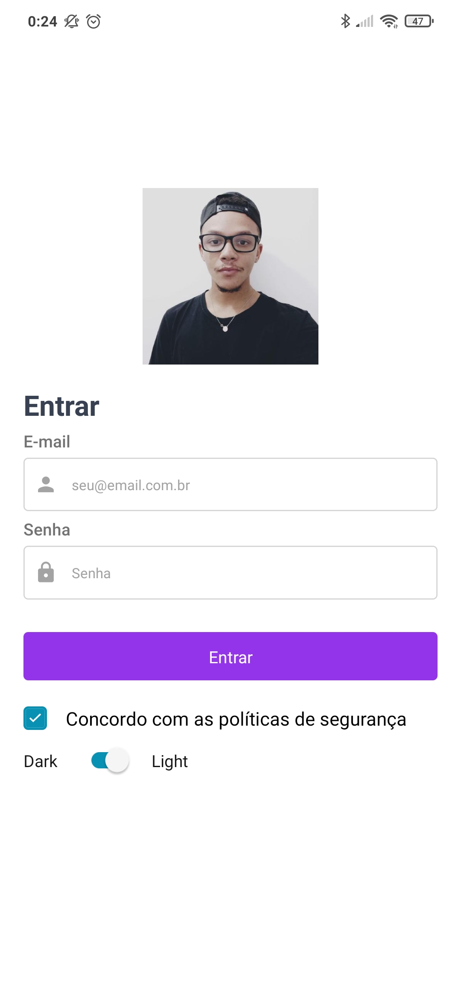
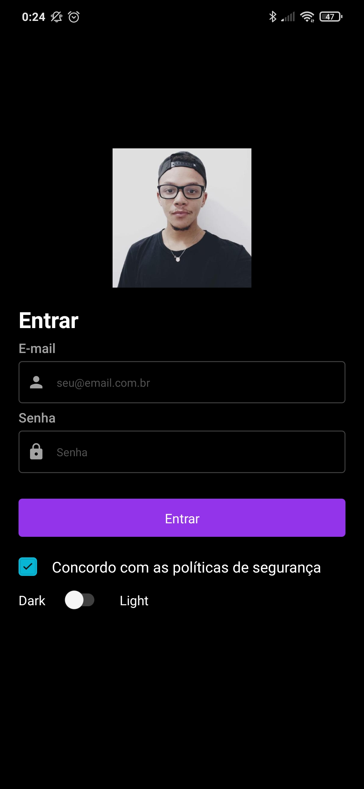

# Layout Login

## Descrição do Projeto
<p align="center">
Este projeto tem como proposito o estudo das tecnologias
React Native utilizando um UI KIT.
</p>

<h1 align="center">
    <a href="https://docs.nativebase.io/install-expo">🔗 nativebase</a>
</h1>
<p align="center">🚀
    NativeBase é uma biblioteca de componetes que ajuda os devs a criar projetos/APPs utilizando React Native para as plataformas Android, IOS e Web.
</p>
<p align="center">🚀
    NativeBase is a component library that enables devs to build universal design systems. It is built on top of React Native, allowing you to develop apps for Android, iOS and the Web.
</p>

## How to Install

### Front-end (React Native)

* To download the project follow the instructions bellow:

```
1. git clone 
```

* Install the dependencies and start the server:

```
3. npm install
4. npm start
```

## Screen Shots


* Login Modo Claro/Light



* Login Modo Escuro/Dark


